# 📋 Spring Expert 과제 - 일정 관리 애플리케이션

[](https://openjdk.java.net/)
[](https://spring.io/projects/spring-boot)
[](https://spring.io/projects/spring-security)
[](http://querydsl.com/)
[](https://redis.io/)
[](https://aws.amazon.com/)

---

## 📖 프로젝트 소개

사용자, 할 일, 댓글, 담당자를 관리하는 **일정 관리 REST API** 서비스입니다.
코드의 버그를 직접 발견 및 수정하고, 성능 최적화, 인증/인가 고도화, 대용량 데이터 처리, AWS 배포까지 단계별로 진행했습니다.

### 🎯 단계별 구현 목표

|     단계     | 목표                                     | 핵심 기술 |
|:----------:|:---------------------------------------|:---:|
| **LV 1-①** | `@Transactional` 읽기 전용 오류 수정           | JPA, Transaction |
| **LV 1-②** | User에 nickname 추가 + JWT 클레임 반영         | JWT |
| **LV 1-③** | weather과 기간 조건 동적 쿼리                   | JPQL |
| **LV 1-④** | 컨트롤러 테스트 코드 수정                         | JUnit 5, MockMvc |
| **LV 1-⑤** | AOP 어드바이스 실행 시점 버그 수정                  | Spring AOP |
| **LV 2-⑥** | JPA Cascade로 담당자 자동 등록                 | JPA Cascade |
| **LV 2-⑦** | 댓글 조회 N+1 문제 해결                        | JPQL Fetch Join |
| **LV 2-⑧** | JPQL → QueryDSL 전환                     | QueryDSL |
| **LV 2-⑨** | Filter/Resolver → Spring Security 전환   | Spring Security |
| **LV 3-⑩** | QueryDSL 고급 검색 API (Projections + 페이징) | QueryDSL |
| **LV 3-⑪** | 매니저 등록 로그 독립 트랜잭션 처리                   | `REQUIRES_NEW` |
| **LV 3-⑫** | EC2, RDS, S3 클라우드 배포                   | AWS |
| **LV 3-⑬** | 500만 건 Bulk Insert 및 닉네임 검색 최적화        | JDBC, Index, Redis |

---

## 🛠️ 기술 스택

| 구분 | 기술 | 버전 및 설명                                      |
|:---:|:---:|:---------------------------------------------|
| **Language** | Java | JDK 17 (LTS)                                 |
| **Framework** | Spring Boot | **3.3.3**                                    |
| **ORM** | Spring Data JPA | Hibernate <br/> → 동적 쿼리, Cascade             |
| **Query** | QueryDSL | **5.0.0** <br/> → 타입 안전 동적 쿼리, Projections         |
| **Auth** | Spring Security + JWT | `jjwt 0.12.6` <br/> → Stateless 토큰 인증              |
| **Cache** | Redis | `spring-boot-starter-data-redis` <br/> → 닉네임 검색 캐싱 |
| **Database** | H2 / MySQL 8.0 | 로컬 인메모리 / 운영 RDS                             |
| **Storage** | AWS S3 | `spring-cloud-aws 3.1.1` <br/> → 프로필 이미지           |
| **Monitoring** | Spring Actuator | `health`, `info` 엔드포인트                       |
| **Build** | Gradle | Wrapper 포함                             |
| **Deploy** | AWS EC2 | Docker 기반 실행                                 |

---

## 🚀 설치 및 실행 가이드

### 1. 사전 준비

- JDK 17 이상
- Redis 서버 실행 중 (기본 포트 `6379`)
- MySQL 또는 H2 (로컬 테스트 시 H2 권장)

### 2. 프로젝트 클론

```bash
git clone https://github.com/CheatIsKey/spring-plus.git
cd spring-plus
```

### 3. 환경변수 설정

운영 환경(`application.yml`)에서 아래 환경변수가 필요합니다.

| 환경변수 | 설명 |
|:---|:---|
| `DB_URL` | MySQL JDBC URL |
| `DB_USERNAME` | DB 계정명 |
| `PASSWORD` | DB 비밀번호 |
| `SECRET_KEY` | JWT 서명 키 |
| `BUCKET` | S3 버킷명 |
| `S3_ACCESS_KEY` | AWS Access Key |
| `S3_SECRET_KEY` | AWS Secret Key |

> ⚠️ 위 값들을 코드나 공개 저장소에 직접 입력하지 마세요.  
> `.env` 파일 또는 시스템 환경변수로 관리하는 것을 권장합니다.

### 4. 빌드 및 실행

```bash
# Mac / Linux
./gradlew bootRun

# Windows
gradlew.bat bootRun
```

### 5. 헬스체크 확인

```bash
curl http://localhost:8080/actuator/health
# → {"status":"UP"}
```

---

## 🔌 API 명세

### 📌 인증 (Auth)

| 메서드 | 경로 | 설명 | 인증 필요 |
|:---:|:---|:---|:---:|
| `POST` | `/auth/signup` | 회원가입 (nickname 포함) | ❌ |
| `POST` | `/auth/signin` | 로그인 → JWT 발급 | ❌ |

### 📌 할 일 (Todo)

| 메서드 | 경로 | 설명                             | 인증 필요 |
|:---:|:---|:-------------------------------|:---:|
| `POST` | `/todos` | 할 일 생성 (담당자 자동 등록)             | ✅ |
| `GET` | `/todos` | 목록 조회 (weather 및 기간 필터)        | ❌ |
| `GET` | `/todos/{todoId}` | 단건 조회                          | ❌ |
| `GET` | `/todos/detail` | 고급 검색 <br/> → 제목, 생성일, 담당자 닉네임 | ✅ |

### 📌 댓글 (Comment)

| 메서드 | 경로 | 설명 | 인증 필요 |
|:---:|:---|:---|:---:|
| `POST` | `/todos/{todoId}/comments` | 댓글 작성 | ✅ |
| `GET` | `/todos/{todoId}/comments` | 댓글 목록 조회 (N+1 해결) | ✅ |

### 📌 담당자 (Manager)

| 메서드 | 경로 | 설명 | 인증 필요 |
|:---:|:---|:---|:---:|
| `POST` | `/todos/{todoId}/managers` | 담당자 등록 (로그 자동 기록) | ✅ |
| `GET` | `/todos/{todoId}/managers` | 담당자 목록 조회 | ✅ |
| `DELETE` | `/todos/{todoId}/managers/{managerId}` | 담당자 삭제 | ✅ |

### 📌 유저 (User)

| 메서드 | 경로 | 설명 | 인증 필요 |
|:---:|:---|:---|:---:|
| `GET` | `/users/{userId}` | 유저 단건 조회 | ✅ |
| `GET` | `/users?nickname=xxx` | 닉네임 검색 (Redis 캐시 적용) | ✅ |
| `PUT` | `/users` | 비밀번호 변경 | ✅ |
| `POST` | `/users/profile` | 프로필 이미지 업로드 (S3) | ✅ |

### 📌 관리자 (Admin)

| 메서드 | 경로 | 설명 | 권한 |
|:---:|:---|:---|:---:|
| `PATCH` | `/admin/users/{userId}` | 유저 권한 변경 | ADMIN |
| `DELETE` | `/admin/comments/{commentId}` | 댓글 강제 삭제 | ADMIN |

---

## 📋 요구사항별 구현 상세

### LV 1 — 필수 기능

---

#### 1️⃣ `@Transactional` 읽기 전용 오류 수정

**문제 상황**

`POST /todos` 호출 시 아래 에러가 발생했습니다.

```
Connection is read-only. Queries leading to data modification are not allowed
```

`TodoService` 클래스 레벨에 `@Transactional(readOnly = true)`가 선언되어 있어,
데이터를 쓰는 `saveTodo()` 메서드도 읽기 전용 트랜잭션으로 실행된 것이 원인입니다.

**수정 방법**

`saveTodo()` 메서드에 `@Transactional`을 **직접** 붙여 쓰기 트랜잭션을 명시합니다.

```java
// 클래스 레벨: @Transactional(readOnly = true)

@Transactional  // 메서드 레벨이 클래스 레벨을 오버라이드 → 쓰기 가능
public TodoSaveResponse saveTodo(AuthUser authUser, TodoSaveRequest request) { ... }
```

> 💡 `readOnly = true`는 SELECT 쿼리에 대한 성능 최적화(스냅샷 생략 등)에 유용합니다.  
> INSERT / UPDATE / DELETE가 필요한 메서드에는 반드시 `@Transactional`을 별도로 선언하세요.

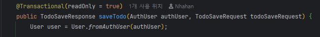

---

#### 2️⃣ User에 nickname 추가 + JWT 클레임 반영

**변경 사항**

- `users` 테이블에 `nickname` 컬럼 추가 (중복 허용)
- 회원가입 요청 Body에 `nickname` 필드 추가
- JWT 발급 시 `nickname` 클레임 포함 → 프론트엔드에서 토큰 파싱만으로 닉네임 사용 가능

```java
// JwtTokenProvider — 토큰 생성 시 nickname 클레임 추가
Claims claims = Jwts.claims()
    .add("userId",   user.getId())
    .add("email",    user.getEmail())
    .add("nickname", user.getNickname())  // ← 추가
    .add("userRole", user.getUserRole())
    .build();
```

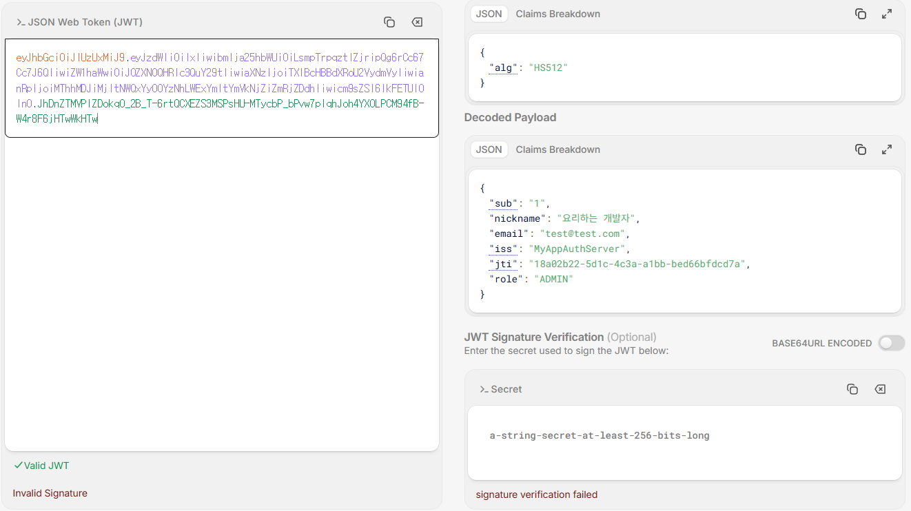

---

#### 3️⃣ JPQL 동적 쿼리 — weather 및 기간 검색

**구현 내용**

`weather`, `startDate`, `endDate` 조건이 모두 선택적(`null` 가능)이므로,
서비스 계층에서 조건 조합에 따라 적합한 JPQL을 호출합니다.

| weather | 기간 | 호출 쿼리 |
|:---:|:---:|:---|
| ✅ | ✅ | weather + 기간 필터 |
| ✅ | ❌ | weather 필터만 |
| ❌ | ✅ | 기간 필터만 |
| ❌ | ❌ | 전체 조회 |

```java
// 예시 — weather + 기간 조건
@Query("SELECT t FROM Todo t WHERE t.weather = :weather " +
       "AND t.modifiedAt BETWEEN :start AND :end ORDER BY t.modifiedAt DESC")
Page<Todo> findByWeatherAndPeriod(...);
```

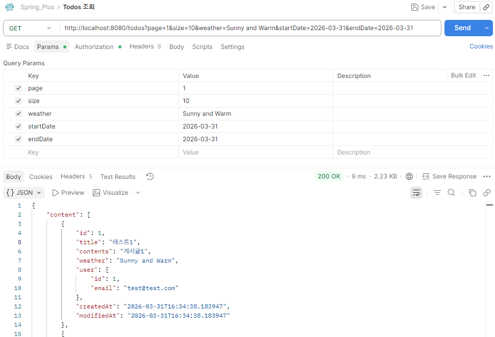

---

#### 4️⃣ 컨트롤러 테스트 코드 수정

**문제 상황**

`todo_단건_조회_시_todo가_존재하지_않아_예외가_발생한다()` 테스트가 실패했습니다.
`TodoService.getTodo()`는 `InvalidRequestException`을 던지지만,
테스트가 기대하는 예외 타입 또는 HTTP 상태코드가 실제와 달랐습니다.

**수정 방법**

`@MockBean`으로 서비스 스터빙을 올바르게 설정하고, 기댓값을 실제 동작에 맞게 수정했습니다.

```java
given(todoService.getTodo(anyLong()))
    .willThrow(new InvalidRequestException("Todo not found"));

mockMvc.perform(get("/todos/{todoId}", 1L))
    .andExpect(status().isBadRequest());  // 실제 응답 코드와 일치하도록 수정
```

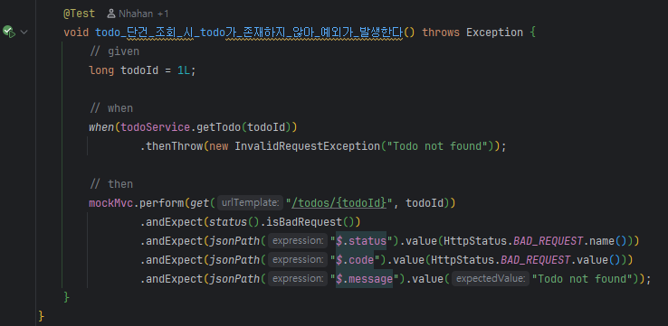

---

#### 5️⃣ AOP 어드바이스 실행 시점 수정

**문제 상황**

`UserAdminController.changeUserRole()` **실행 전**에 로그를 남겨야 하는데,
`AdminAccessLoggingAspect`의 포인트컷이 `UserController.getUser()`를 대상으로 잘못 지정되어 있었습니다.

**수정 방법**

포인트컷 대상을 올바른 메서드로 변경합니다.

```java
// 수정 전
@Before("execution(* org.example.expert.domain.user.controller.UserController.getUser(..))")

// 수정 후
@Before("execution(* org.example.expert.domain.user.controller.UserAdminController.changeUserRole(..))")
public void logBeforeChangeUserRole(JoinPoint joinPoint) { ... }
```

> 💡 `@Before`는 메서드 실행 **전**, `@After`는 **후**, `@Around`는 **전후 모두** 제어합니다.  
> 요구사항이 "실행 전 로깅"이므로 어드바이스 종류는 `@Before`가 정확합니다.

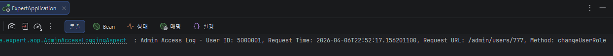

---

### LV 2 — 필수 기능

---

#### 6️⃣ JPA Cascade — 담당자 자동 등록

**구현 내용**

`Todo` 엔티티의 `managers` 컬렉션에 `CascadeType.PERSIST`를 적용합니다.
`Todo`를 저장(`persist`)할 때 `Manager`도 자동으로 함께 INSERT됩니다.

```java
// Todo.java
@OneToMany(mappedBy = "todo", cascade = CascadeType.PERSIST)
private List<Manager> managers = new ArrayList<>();

// Todo 생성자 — 생성자를 담당자 목록에 추가
public Todo(String title, String contents, String weather, User user) {
    this.user = user;
    this.managers.add(new Manager(user, this));
}
```

> 💡 **Cascade란?** 부모 엔티티(Todo)에 가해진 JPA 작업을 자식 엔티티(Manager)에도 자동으로 전파하는 기능입니다.  
> `PERSIST`만 적용했으므로 Todo 삭제 시 Manager가 연쇄 삭제되는 것은 별도의 `CascadeType.REMOVE`로 제어합니다.

---

#### 7️⃣ N+1 문제 해결

**문제 상황**

`GET /todos/{todoId}/comments` 호출 시 댓글 수(N)만큼 유저 정보를 개별 조회합니다.

```sql
-- 개선 전: 댓글이 100개면 쿼리 101번 실행
SELECT * FROM comments WHERE todo_id = ?;
SELECT * FROM users WHERE id = 1;
SELECT * FROM users WHERE id = 2;
-- ... N번 반복
```

**수정 방법**

JPQL에 `JOIN FETCH`를 추가해 댓글과 유저를 한 번에 가져옵니다.

```java
@Query("SELECT c FROM Comment c JOIN FETCH c.user WHERE c.todo.id = :todoId")
List<Comment> findByTodoIdWithUser(@Param("todoId") Long todoId);
```

```sql
-- 개선 후: 단 1번의 쿼리로 해결
SELECT c.*, u.*
FROM comments c
INNER JOIN users u ON c.user_id = u.id
WHERE c.todo_id = ?;
```

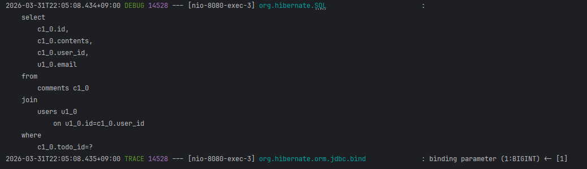

---

#### 8️⃣ QueryDSL 전환 — `findByIdWithUser`

**구현 내용**

문자열 기반의 JPQL을 **타입 안전한 QueryDSL**로 전환합니다.

```java
// 기존 JPQL
// @Query("SELECT t FROM Todo t LEFT JOIN t.user WHERE t.id = :todoId")

// 변경 후 QueryDSL
@Override
public Optional<Todo> findByIdWithUser(Long todoId) {
    return Optional.ofNullable(
        queryFactory.selectFrom(todo)
            .leftJoin(todo.user).fetchJoin()   // N+1 방지
            .where(todo.id.eq(todoId))
            .fetchOne()
    );
}
```

| 구분 | JPQL | QueryDSL |
|:---:|:---:|:---:|
| **오류 감지** | 런타임 | **컴파일 타임** |
| **타입 안전성** | 문자열 기반 | **Q클래스 기반** |
| **동적 쿼리** | 복잡 | **BooleanExpression으로 간결** |

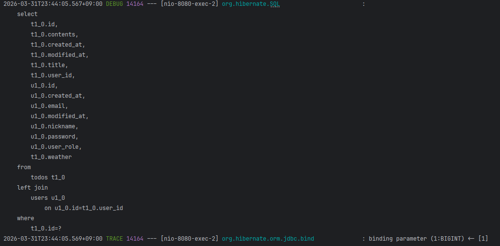

---

#### 9️⃣ Spring Security 전환

**변경 내용**

기존의 커스텀 `Filter` + `ArgumentResolver` 방식을 Spring Security로 전환합니다.

```
    [변경 전]                         [변경 후]
AuthFilter (커스텀)       →     JwtAuthenticationFilter
ArgumentResolver         →     SecurityContextHolder
서비스 코드 내 권한 체크    →     SecurityConfig 선언적 관리
```

**SecurityConfig 핵심 설정:**

```java
.sessionManagement(session ->
    session.sessionCreationPolicy(SessionCreationPolicy.STATELESS)  // JWT → 세션 미사용
)
.authorizeHttpRequests(auth -> auth
    .requestMatchers("/auth/**", "/actuator/**").permitAll()         // 인증 없이 허용
    .requestMatchers("admin/**").hasAuthority("ROLE_ADMIN")          // 관리자만 허용
    .anyRequest().authenticated()                                    // 나머지는 인증 필수
)
.addFilterBefore(
    new JwtAuthenticationFilter(provider),
    UsernamePasswordAuthenticationFilter.class
);
```

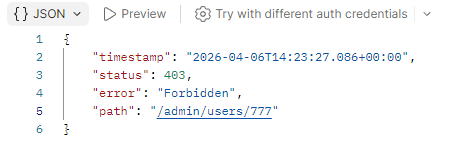

---

### LV 3 — 도전 기능

---

#### 🔟 QueryDSL 고급 검색 API

**엔드포인트:** `GET /todos/detail`

**검색 조건** (모두 선택 사항)

| 파라미터 | 설명 |
|:---|:---|
| `titleKeyword` | 제목 부분 검색 (대소문자 무시) |
| `startDate` / `endDate` | 생성일 기간 검색 |
| `nicknameKeyword` | 담당자 닉네임 부분 검색 |

**응답 필드** — `Projections`으로 필요한 필드만 반환합니다.

| 필드 | 설명 |
|:---|:---|
| `title` | 할 일 제목 |
| `managerCount` | 담당자 수 |
| `commentCount` | 댓글 수 |

**QueryDSL 쿼리 구조:**

```java
queryFactory
    .select(Projections.constructor(TodoDetailResponse.class,
        todo.title,
        manager.countDistinct(),
        comment.countDistinct()
    ))
    .from(todo)
    .leftJoin(todo.managers, manager)
    .leftJoin(manager.user, user)
    .leftJoin(todo.comments, comment)
    .where(
        titleKeywordCondition(condition.titleKeyword()),
        startDateCondition(condition.startDate()),
        endDateCondition(condition.endDate()),
        managerKeywordCondition(condition.nicknameKeyword())
    )
    .groupBy(todo.id, todo.title, todo.createdAt)
    .orderBy(todo.createdAt.desc())
    .fetch();
```

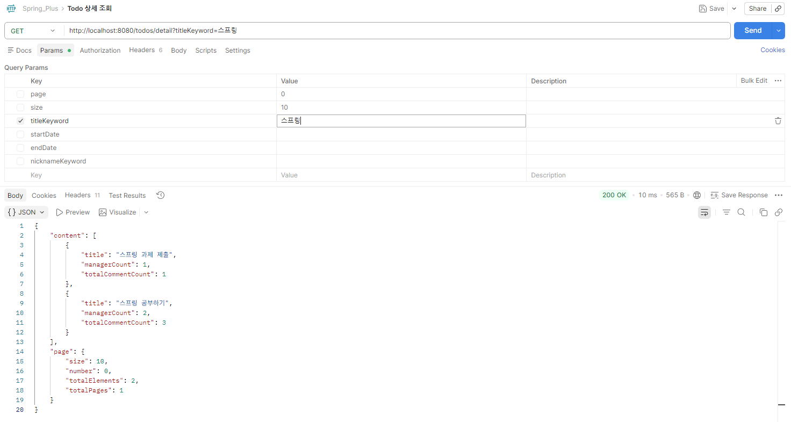
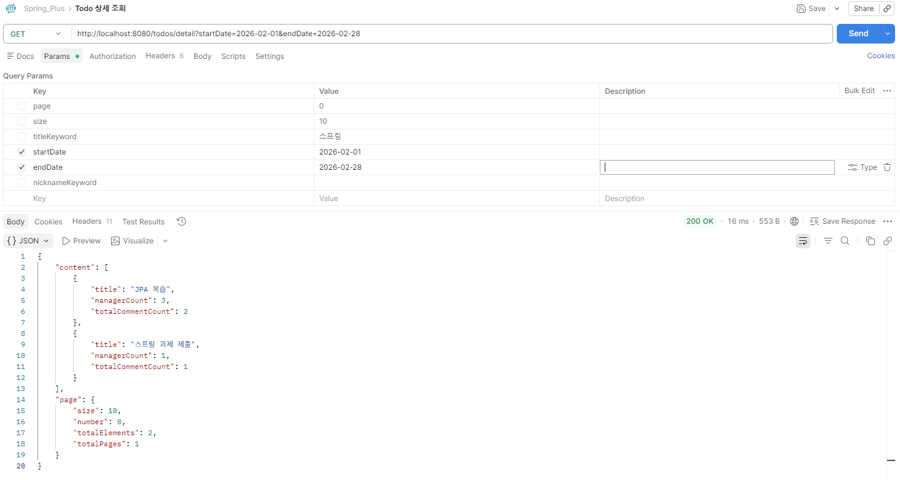
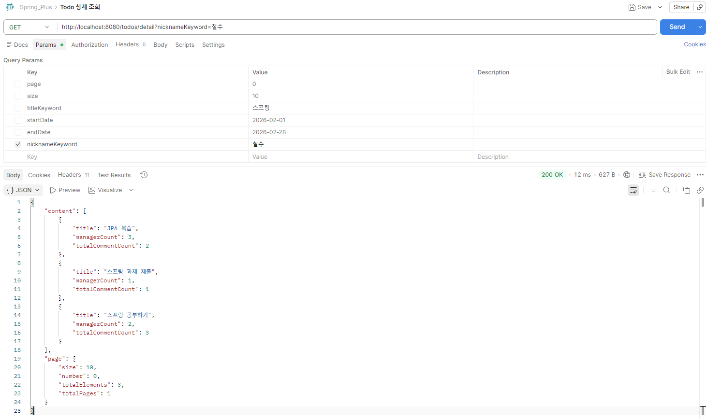

---

#### 1️⃣1️⃣ Transaction 심화 — 매니저 등록 로그

**요구사항**

매니저 등록이 실패하더라도 `log` 테이블에는 반드시 요청 기록이 남아야 합니다.

**해결 방법: `REQUIRES_NEW`로 트랜잭션 분리**

```java
// LogService — 호출 측 트랜잭션과 완전히 독립된 새 트랜잭션으로 실행
@Transactional(propagation = Propagation.REQUIRES_NEW)
public void save(Long todoId, Long requestUserId, Status result, String failReason) {
    logRepository.save(new Log(todoId, requestUserId, result, failReason));
}
```

**동작 흐름:**

```
[ManagerService - 트랜잭션 A 시작]
      ├── 매니저 등록 로직 실행
      ├── LogService.save() 호출
      │         └── [트랜잭션 B 독립 시작 → 즉시 커밋] ← REQUIRES_NEW
      ├── 등록 성공 → 트랜잭션 A 커밋
      └── (실패 시) 트랜잭션 A 롤백
                   → 하지만 트랜잭션 B(로그)는 이미 커밋 완료 ✅
```

> 💡 같은 트랜잭션 안에 있으면 매니저 등록 실패 시 로그도 함께 롤백됩니다.  
> `REQUIRES_NEW`로 분리하면 성공/실패 여부와 무관하게 로그가 항상 보존됩니다.

**log 테이블 스키마:**

| 컬럼 | 타입 | 설명 |
|:---|:---:|:---|
| `id` | BIGINT PK | 로그 ID |
| `todo_id` | BIGINT | 관련 할 일 ID |
| `request_user_id` | BIGINT | 요청 유저 ID |
| `result` | VARCHAR | `SUCCESS` / `FAIL` |
| `fail_reason` | VARCHAR | 실패 사유 (성공 시 null) |
| `created_at` | DATETIME | 로그 생성 시각 |

---

#### 1️⃣2️⃣ AWS 클라우드 배포

##### 12-1. EC2

- Amazon Linux 2023 인스턴스에 Docker로 애플리케이션 실행
- 탄력적 IP(Elastic IP) 할당 — 재시작해도 주소 유지
- 헬스체크 API: `http://52.79.200.211:8080/actuator/health` → `{"status":"UP"}`

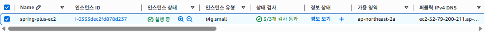

---

##### 12-2. RDS

- MySQL 8.0 RDS 인스턴스 생성
- 보안 그룹 인바운드: **EC2 보안 그룹 ID**만 허용 (외부 직접 접근 차단)
- DB 접속 정보는 환경변수로 주입 (`DB_URL`, `DB_USERNAME`, `PASSWORD`)

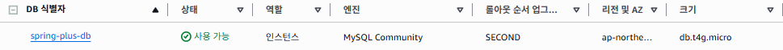

---

##### 12-3. S3

- S3 버킷 생성 (퍼블릭 액세스 차단)
- `POST /users/profile` — 이미지 업로드 → S3 저장
- `GET  /users/profile?key=xxx` — Presigned URL 발급 (1시간 유효)


---

#### 1️⃣3️⃣ 대용량 데이터 처리 — 500만 건 닉네임 검색 최적화

##### Bulk Insert (JDBC)

JPA `save()` 반복 호출은 건당 INSERT로 500만 건에서 매우 느립니다.  
`JdbcTemplate.batchUpdate()`로 한 번에 대량 INSERT합니다.

```java
// DataInitializer.java (테스트 코드)
jdbcTemplate.batchUpdate(
    "INSERT INTO users (nickname, email, password, user_role) VALUES (?, ?, ?, ?)",
    new BatchPreparedStatementSetter() {
        @Override
        public void setValues(PreparedStatement ps, int i) throws SQLException {
            ps.setString(1, UUID.randomUUID().toString().substring(0, 8)); // 랜덤 닉네임
            ps.setString(2, "user" + i + "@test.com");
            ps.setString(3, encodedPassword);
            ps.setString(4, "USER");
        }
        @Override
        public int getBatchSize() { return 5_000_000; }
    }
);
```

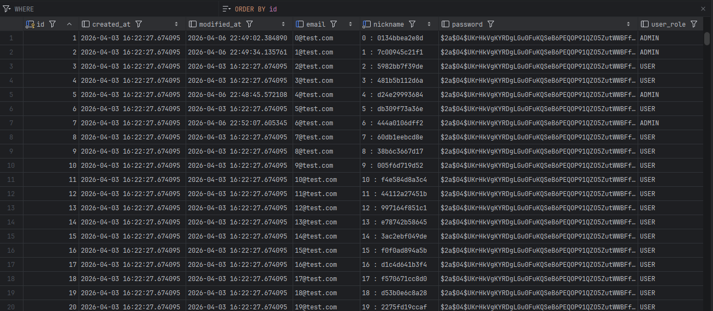

##### 검색 성능 최적화

`GET /users?nickname=xxx` — 닉네임 **완전 일치** 검색

| 단계 | 방법 | 조회 시간 |
|:---:|:---|:---:|
| **1단계** | 인덱스 없음 (Full Table Scan) | 측정값 기재 |
| **2단계** | `nickname` 컬럼 인덱스 추가 | 측정값 기재 |
| **3단계** | Redis 캐시 적용 (`@Cacheable`, TTL 10분) | 측정값 기재 |

**인덱스 정의 (User 엔티티):**

```java
@Table(name = "users", indexes = {
    @Index(name = "idx_user_nickname", columnList = "nickname")
})
```

**Redis 캐시 설정:**

```java
// UserService — 동일 닉네임 두 번째 요청부터 DB 조회 없이 캐시에서 반환
@Cacheable(value = "users", key = "'nickname:' + #nickname")
public List<UserPageResponse> getUserByNickname(String nickname) { ... }

// RedisConfig — TTL 10분, JSON 직렬화
RedisCacheConfiguration config = RedisCacheConfiguration.defaultCacheConfig()
    .entryTtl(Duration.ofMinutes(10));
```

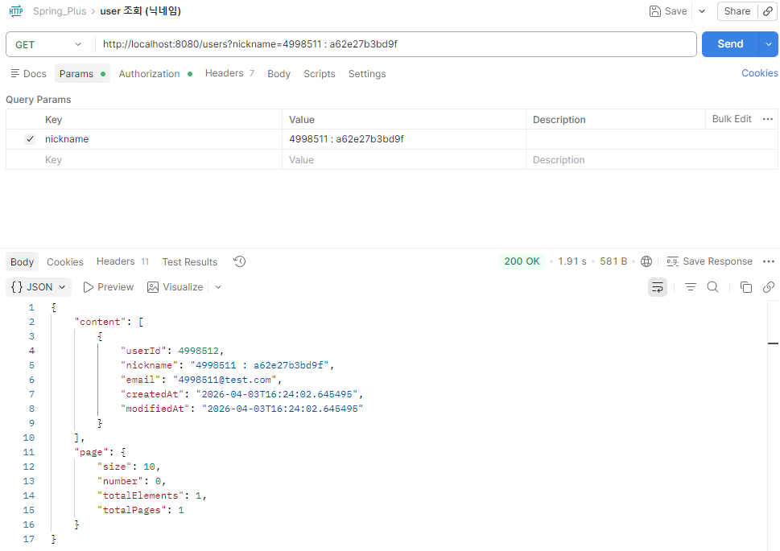

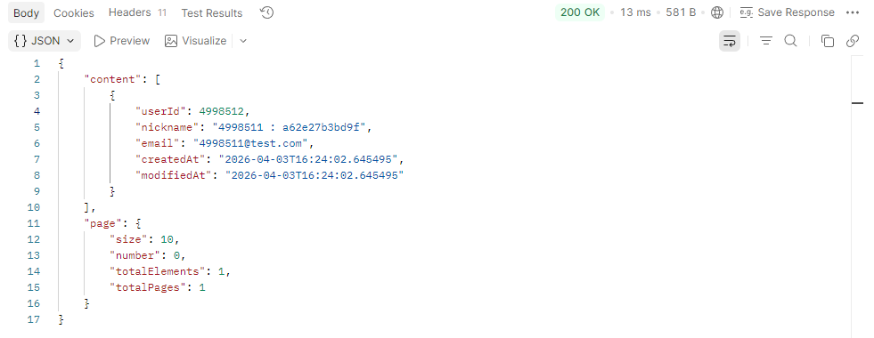

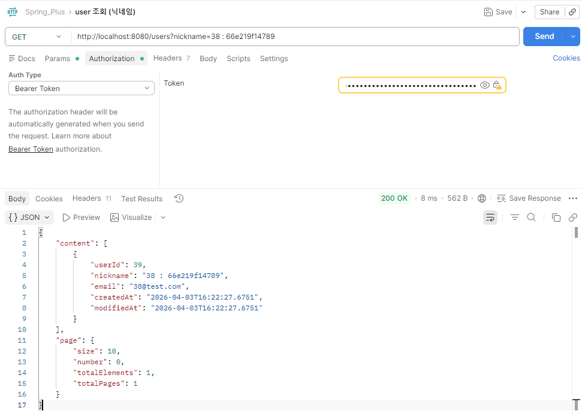

---

## 💡 기술적 의사결정

### 1️⃣ Spring Security 도입

> **"관심사 분리 + 선언적 인가 관리"**
>
> 기존 커스텀 Filter는 JWT 검증만 처리하고, 권한 체크는 서비스 코드 곳곳에 흩어져 있었습니다.  
> Spring Security는 인증(Authentication)과 인가(Authorization)를 프레임워크 레벨에서 통합합니다.  
> 경로별 권한 규칙을 `SecurityConfig` 한 곳에서 선언적으로 관리할 수 있어 유지보수성이 높아집니다.

### 2️⃣ QueryDSL 선택

> **"컴파일 타임 안전성 + 복잡한 동적 쿼리"**
>
> JPQL은 문자열 기반이라 오타가 있어도 런타임에야 오류를 알 수 있습니다.  
> QueryDSL은 Q클래스를 통해 IDE 자동완성과 컴파일 검증이 가능합니다.  
> 제목·기간·닉네임을 조합하는 고급 검색처럼 조건 경우의 수가 많을수록 `BooleanExpression`의 장점이 극대화됩니다.

### 3️⃣ `REQUIRES_NEW`로 로그 트랜잭션 분리

> **"비즈니스 실패와 무관하게 로그는 반드시 남긴다"**
>
> 같은 트랜잭션 안에 로그가 있으면 매니저 등록 실패 시 로그도 함께 롤백됩니다.  
> `REQUIRES_NEW`로 로그 저장을 별도 트랜잭션으로 분리하면 성공·실패 여부와 무관하게 로그가 항상 커밋됩니다.

### 4️⃣ Redis 캐시로 닉네임 검색 최적화

> **"500만 건에서 인덱스만으로는 부족할 때"**
>
> DB 인덱스만으로도 속도가 크게 개선되지만, 동일한 닉네임 검색이 반복되면 매번 DB를 조회합니다.  
> `@Cacheable`로 결과를 Redis에 캐싱하면 두 번째 요청부터는 DB를 거치지 않습니다.  
> TTL 10분으로 설정해 데이터 정합성과 성능 사이의 균형을 맞췄습니다.